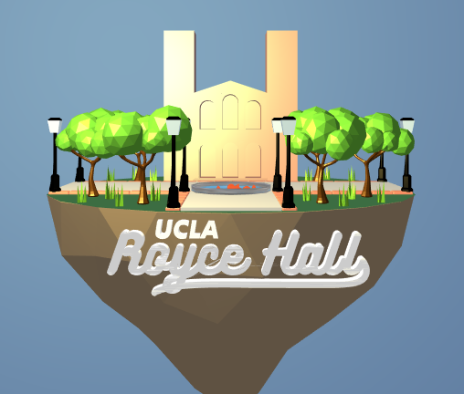
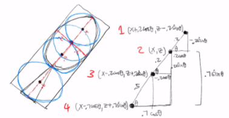
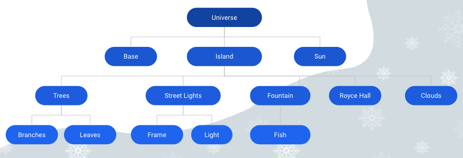

# Royce sQuad - Royce Quad Weather Simulator
Fall 2020 Final Project for CS 174A   
Teammates: Anh Mac, Bradley Mont, Daniel Koo, Simwon (Sally) Seok

A weather simulator that replicates the beautiful scenery at Royce Quad with Royce Hall as the center of the scene on a floating island for aesthetic purposes.  This serves as a cute, little simulation in its own world.
 
 
 
 
 
 
 
 
## Main Features
* `(n) Day/Night time` Switch from daytime to nighttime, changing from 1 light source (sun) to multiple light sources (streetlights).
* `(q) Rain` Initiate rainfall, droplets are spawned randomly. Their motion is calculated using kinematics equations involving gravity.
* `(e) Snow` Initiate snowfall, snowballs are of rounder shapes than rain droplets and fall at a slower rate.
* `(c) Add cloud` Add clouds to the scene. Every cloud lowers the light intensity to simulate the sun being blocked.
* `(l) Clear clouds` Clear all clouds in the scene.
* `(v) Fountain view` Switch to view the fountain directly from above. You can observe the collision detection implemented as the fish swim.
* `(r) Rotate` Put the island into a rotating motion to view the scene in all directions.
* `(Shift+R) Reset Island` Stop rotation and resetting the island to its initial position.
* `(Enter) Stop music` Stop the music.

### Seasonal Characteristics
Season | Description
------------ | -------------
`(1) Spring` | 🌤🌸 Slightly cloudy sky, trees blossom pink leaves
`(2) Summer` | ☀️🌿 Clear sky, green trees
`(3) Fall` | 🌦🍂 Moderately cloudy sky, heavy rainfall, red trees with leaves falling (implemented using kinematics)
`(4) Winter` | 🌨❄️ Extremely cloudy sky, snowfall, the fountain and fish are frozen, ground is covered with snow
`(x) Happy Holidays!` | 🎄🎁 Streetlights change to bright, colorful colors and Mistletoe by Justin Bieber is played *NOTE: Only available at NIGHT, during WINTER* 

### Objects modeling
Royce Hall, trees, leaves, 3D grass, concrete walkway, bricks, and streetlights were modeled and imported as .obj files using Blender. 
Snow, rain, fish, and fountain were created as complex shapes using the existing primitive shapes available in tiny-graphics.js library.

## Advanced Features
### Collision Detection

Each fish was modeled as a sphere with a cone attached, and flattened. To detect collision with the fountain walls, we simply used radii since the fountain is circular.
To detect collision with each other, we assigned 4 colliders (points) to each fish: head, center body, lower body, and tail. These points are calculated using trigonometry, based on the fish's (x,z) coordinates and its current direction. By having 4 points on each fish, instead of just 1, we were able to more precisely approximate the non-sperical shape of the fish.
 
 
 

### Scene Graph

We utilized a scene graph to construct the Royce Quad island. This was done by creating a `SceneNode` object that would hold information on an object to be drawn. These nodes were then inserted into a tree that corresponds to the hierarchial structure of our scene. Each `SceneNode` has a `local_transform` matrix that is calculated based on where we want the node to be relative to its parent. A node also has a `world_transform` matrix that is calculated during a recursive traversal through the scene graph by multiplying its parent's world transform matrix to its local transform matrix.

Using the scene graph allowed us to easily add and manipulate objects in our scene with minimal code to calculate all objects matrix. This was important as we had many objects to handle. It also allowed us to move our whole island synchronously as evident in the rotation.

## Demo

A video of the demo can be watched [here](https://www.youtube.com/watch?v=nm2oY81tV9s).
